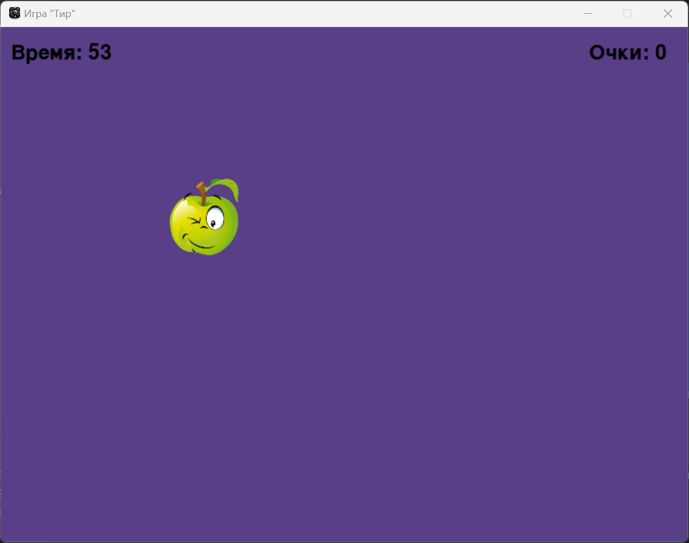

# Игра "Тир"

Игра "Тир" - это увлекательная аркадная игра на Python, использующая библиотеку Pygame. Игрок должен поразить движущуюся цель в течение установленного времени.



## Особенности

- **Настройка сложности**: Игрок может выбрать один из трех уровней сложности, которые определяют скорость перемещения целей.
- **Временные ограничения**: Игра предлагает на выбор несколько временных промежутков для игры, от 10 до 60 секунд.
- **Счёт и обратная связь**: Отображение текущего счёта и времени, а также немедленная обратная связь при попадании или промахе.
- **Текстовый ввод**: Ввод имени для сохранения результатов в лидерборде.
- **Лидерборд**: Просмотр топ-10 результатов по выбранной сложности и продолжительности игры.

## Используемые технологии

- [Python](https://www.python.org/)
- [Pygame](https://www.pygame.org/news)
- [Pygame_textinput](https://github.com/Nearoo/pygame-text-input)

## Установка и запуск

Чтобы запустить игру, убедитесь, что у вас установлен Python и библиотека Pygame. Клонируйте репозиторий и запустите файл `main.py`:

```bash
git clone https://github.com/your-repository/game-shooting-range.git
cd game-shooting-range
python main.py
```

## Как играть

1. Запустите игру.
2. Выберите уровень сложности и время игры с помощью клавиш со стрелками и подтвердите выбор клавишей Enter.
3. Попытайтесь набрать как можно больше очков, поражая цели.
4. Введите ваше имя после окончания игры для сохранения вашего результата.
5. Изучите лидерборд и закройте игру или начните заново.

## Разработчики

- Харитонов Юрий - Основной разработчик проекта.

---

### Выйти из игры или перезапустить

Используйте кнопки **ВЫХОД** и **ПЕРЕЗАПУСТИТЬ**, которые появляются в конце игры, для выхода из игры или её перезапуска.

---

*Спасибо за использование моей игры! Надеюсь, вам понравится!*